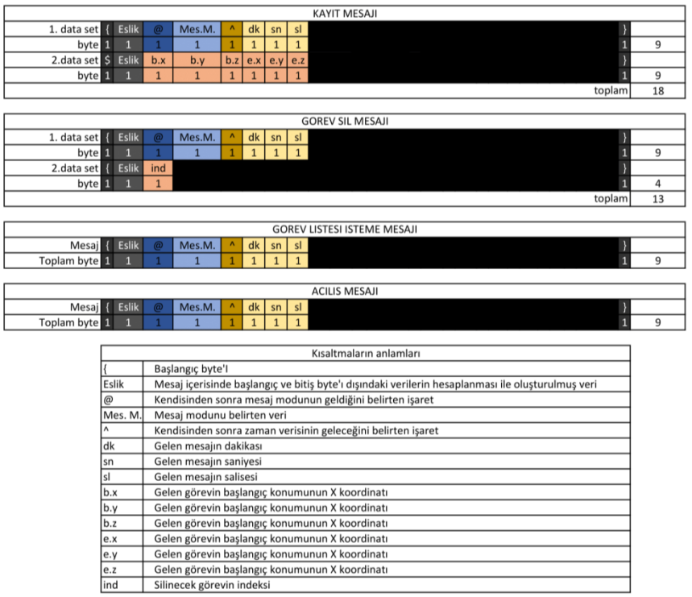
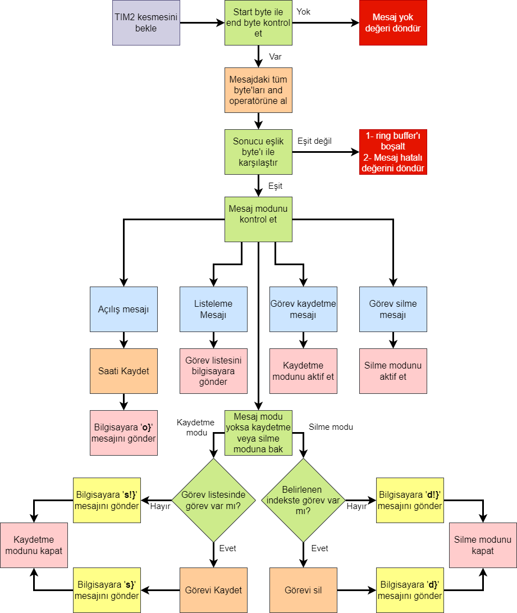
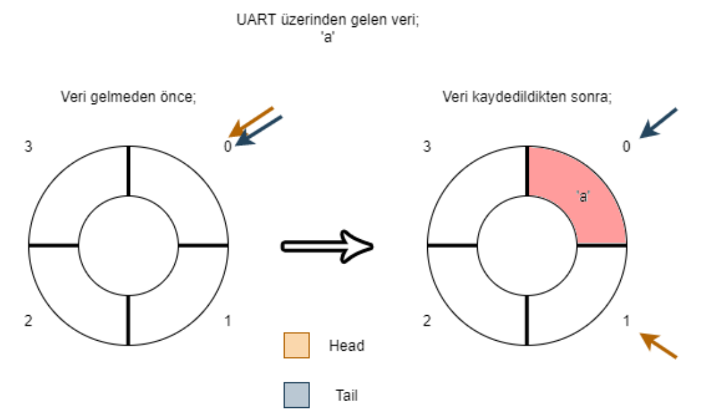
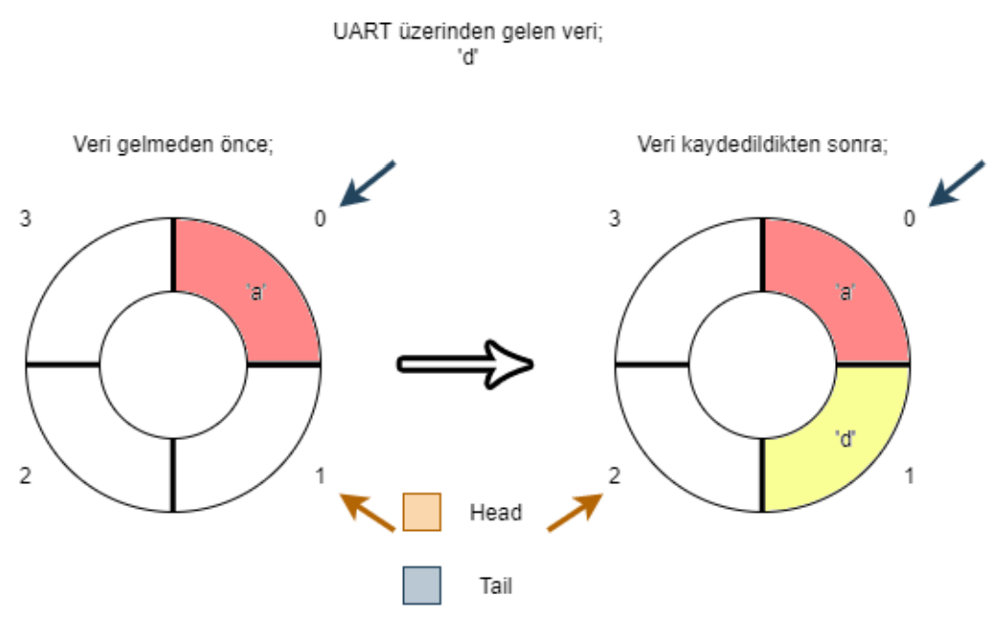
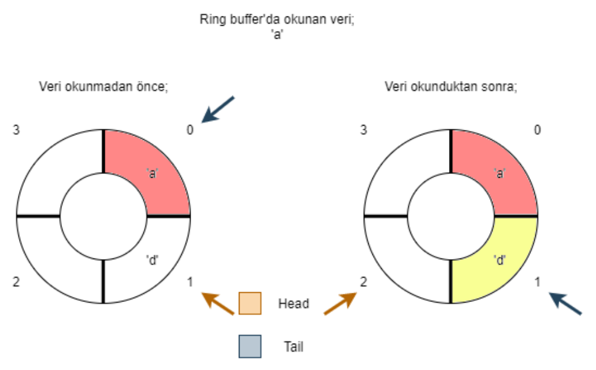
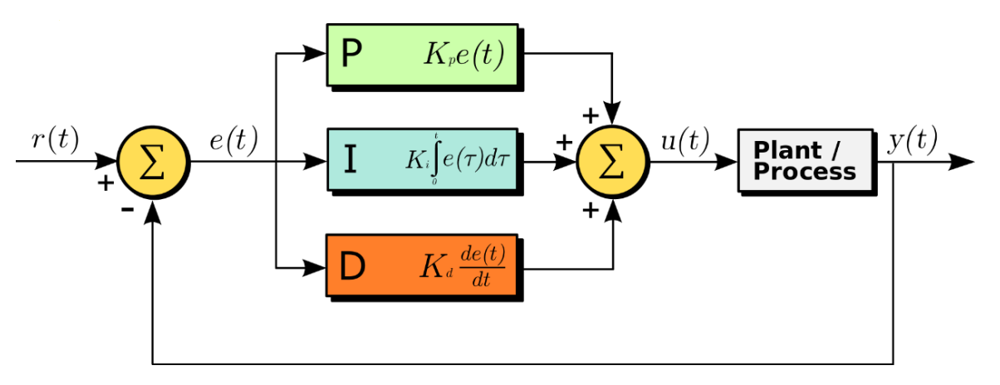
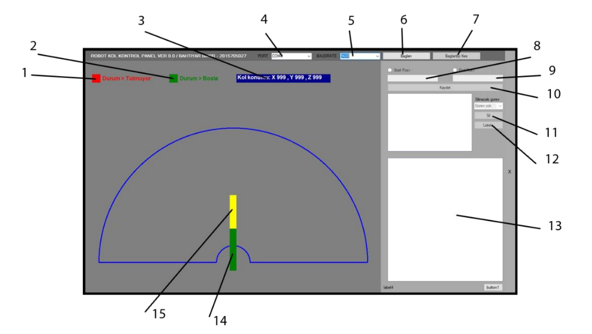

# Robot Kol ( Bitirme Projesi )

Günümüzde ağırlıklı olarak üretim sanayisinde kullanılan robot kollar sayesinde üretim hızı artmış, hata payları da azalmıştır. Bu yapılar önceden programlanarak belirtilen görevi yerine getirmektedirler. İnsanlara kıyasla yorulma, hastalanma, ölüm gibi olumsuz unsurları bulunmadığı için üretimde aksama riskini de minimum seviyeye indirmişlerdir. 

Bu çalışmada, içerisinde STM firmasının ürettiği güçlü bir mikrodenetleyici 
bulunduran STM32F4-Discovery geliştirme kartı kullanılarak prototip seviyesinde robot kol geliştirilmesi hedeflenmiştir. 

C yazılım dili kullanılarak programlanan bu geliştirme kartı, robot kolun bütün işlevlerini yerine getirmesi beklenmiştir (bilgisayar ile haberleşme, motor kontrolü ve sürülmesi vb.). 

Bilgisayar ortamında ise C# dili ile bir Windows Form Application  geliştirilmiş ve seri port kullanılarak robot kol ile iletişim kurulmuş, durum takibi ve görev ataması gibi işlemlerin yerine getirilmesi hedeflenmiştir.

__________

## 1 - KULLANILAN MODÜLLER

Çalışmada kullanılan modüllerin listesi;

1. STM32F4-Discovery geliştirme kartı
2. PL2303 USB-TTL dönüştürücü
3. MG90S Servomotor
4. 3D Printer’dan üretilmiş robot kol gövdesi

_____________

## 2 - PROJE BAĞLANTI ŞEMASI

Robot kolun bağlantı şeması yukarıda verildiği gibidir. Servo motorların kontrolü için 
geliştirme kartının beslemesi yetersiz kaldığı için harici bir güç kaynağından besleme 
alınmıştır.

_____________

## 3 - YAZILIM ÇALIŞMALARI

Robot kolun geliştirilmesi iki aşamalı olarak gerçekleştirilmiştir. Bu aşamalar;

1. Gömülü sistem yazılımı
2. Kontrol ara yüzü geliştirilmesi

Şeklindedir.

### 3.1 - Gömülü Sistem Yazılımı

Bu alanda çalışmalar C dili ile Keil MDK-ARM V5.27 ortamında geliştirilmiştir. Sistem kesmeler (interrupt) ile oluşturulmuştur. 3 adet kesme ile sistem belirli periyotlarla kontrol edilerek çalışmaktadır. 

Bilgisayar ile haberleşmede belleğin daha verimli kullanılabilmesi için ring buffer algoritması kullanılmıştır. Bu algoritma ile bellekte sadece belirli bir bölüm haberleşme için kullanılmıştır.

Servo motorların kontrolünde ise PID kontrol algoritması kullanılmıştır. Motorların belirlenen açıya ulaşmasında daha stabil bir çalışma hedeflenmiştir.

#### 3.1.1 - Çalışmada Kullanılan Kesmeler

Kullanılan kesmeler;

- Bilgisayar ile haberleşme için UART kesmesi, 
- ring buffer içerisindeki gelen verileri almak için TIM2 kesmesi, 
- Görevlerin gerçekleştirilmesi için TIM3 kesmesi

Şeklindedir.

#### 3.1.2 - Servo Motorlar İçin PWM Sinyali Oluşturma

Servo motorların kontrolü için PWM sinyali kullanılmaktadır. Motorlar, PWM 
sinyalinin logic 1 olduğu süreye göre açılarını değiştirmektedir. Bu PWM sinyalinin frekansı ise 50Hz olmalıdır. Bu sinyali üretmek için TIM8 kullanılmıştır. 4 motorun kontrolü için TIM8’in 4 kanalı kullanılmaktadır.

Sinyali oluşturulması için öncelikle TIM8’in tanımlamasında öncelikle 50Hz’lik bir zamanlama oluşturulması gerekmektedir. Bunun için;

            (Ç𝑎𝑙𝚤ş𝑚𝑎 𝑓𝑒𝑟𝑘𝑎𝑛𝑠𝚤 / ö𝑛 ö𝑙ç𝑒𝑘𝑙𝑒𝑦𝑖𝑐𝑖 ) / p𝑒𝑟𝑖𝑦𝑜𝑑

Formülünden faydalanılmaktadır. STM32F4-Discovery kartının çalışma frekansı 
16MHz olduğu bilindiğine göre uygun ön ölçekleyici ve periyod değeri 
belirlenmelidir. 

Servo motorun kontrolünde daha hassas olması için PWM sinyalinin duty cycle değer aralığı geniş olmalıdır. Bunun için ön ölçekleyici değeri düşük, periyod değeri yüksek seçilirse bu ister sağlanmış olur. Bu çalışmada ön ölçekleyici değer 125 olarak belirlenmiştir. Formülden yola çıkarsak;

            50𝐻𝑧 = (Ç𝑎𝑙𝚤ş𝑚𝑎 𝑓𝑒𝑟𝑘𝑎𝑛𝑠𝚤 / ö𝑛 ö𝑙ç𝑒𝑘𝑙𝑒𝑦𝑖𝑐𝑖 ) / 𝑝𝑒𝑟𝑖𝑦𝑜𝑑
            50𝐻𝑧 = (16𝑀𝐻𝑧 / 125 ) / 𝑝𝑒𝑟𝑖𝑦𝑜𝑑
            𝑃𝑒𝑟𝑖𝑦𝑜𝑑 = 2560

Olarak bulunur. Duty cycle değeri ise 0 ile periyod değer arasındadır. Bu değer sayesinde PWM sinyalinin logic 1 seviyesinde kalacağı süre belirlenmiş olur.

Servo motorun 0 – 180 derece arasında hareket için PWM sinyalinin 0,5ms(%2,5) ile 2,5ms(%12,5) arasında logic 1 seviyesinde olmalıdır. Bu durumda duty cycle değeri;

            𝑚𝑖𝑛𝑖𝑚𝑢𝑚 𝑑𝑢𝑡𝑦 𝑐𝑦𝑐𝑙𝑒 = 2560 ∗ 0,025 = 64
            𝑚𝑎𝑘𝑠𝑖𝑚𝑢𝑚 𝑑𝑢𝑡𝑦 𝑐𝑦𝑐𝑙𝑒 = 2560 ∗ 0,125 = 320

Olarak belirlenir. Bu değer aralığında verilen değere göre servo motor konum almaktadır. (Teorik bilginin yanısıra çalışma esnasında bu değerler farklılık göstermiş olup, minimum duty cycle değeri 60, maksimum duty cycle değeri 305 olarak belirlenmiştir.)

Girilen bir açı değerine göre duty cycle değeri belirlemek için aşağıdaki formül kullanılmıştır. (Formüllerde duty cycle DY olarak kısaltılmıştır.)

            𝐷𝑌 = 𝑚𝑖𝑛.𝐷𝑌 + ((𝑚𝑎𝑘𝑠.𝐷𝑌 − 𝑚𝑖𝑛.𝐷𝑌) ∗ ( 𝑖𝑠𝑡𝑒𝑛𝑒𝑛 𝑎ç𝚤 / 180 ))

Örnek vermek gerekirse 0° derece için duty cycle değer 60 ve 180° derece için duty cycle değer 305 ise 90 derece için;

            𝐷𝑌 = 60 + ((305 − 60) ∗ ( 90 / 180))
            𝐷𝑌 = 60 + (245 ∗ 0,5)
            𝐷𝑌 = 182,5

Olarak bulunmuş olur.

#### 3.1.3 - Haberleşme Senaryosu

Bu alanda bilgisayardan STM32F4 Discovery geliştirme kartına bir mesaj geldiği zaman gerçekleşecek senaryo gösterilmiştir. Aşağıda gelebilecek mesajlar verilmiştir.

Bu tablodan yola çıkarak gelen mesajların işlenmesi alt başlıklarda açıklanmıştır. Sayısal veriler gönderirken gelen karakterin ASCII tablosundaki karşılık geldiği değer gönderilmiştir. Haberleşmede Sayısal veriler 0 – 100 arasında olacağı için başlangıç ve bitiş byte’ları bu aralık dışından seçilmiştir.

Gelen mesajlar öncesinde UART kesmesi ile ring buffer içerisine kaydedilir. Bir yandan da TIM2 kesmesi ring buffer içerisinde mesaj olup olmadığını kontrol eder. Eğer tamamlanmış (başlangıç ve bitiş byte’ları olan) bir mesaj bulursa ring buffer içerisinden mesajı çeker ve işlemeye başlar. Mesajın işlenmesi ve parçalanmasına dair süreçler aşağıdaki akış diyagramında verilmiştir.

#### 3.1.4 - Ring Buffer Algoritması

Ring buffer algoritması, lineer bir yapının iki ucunun birleştirilmesi ile elde edilmiş bir halka olarak düşünülebilir. İçerisinde 2 adet işaretçi barındıran yapı, sadece bu halka içerisinde yazma ve okuma işlemi yapar. Bu sayede bellekte sadece belirlenen bir uzunluktaki alan sabit olarak kullanıldığı için verimli bir yöntemdir.

Dezavantaj, yapının boyutunun sabit olmasıdır. Bu sebeple kullanılacak ring buffer’ın uzunluğunu doğru belirlemek gerekir. 

Çalışma mantığı, içerisinde barındırdığı head ve tail olmak üzere iki işaretçinin veri yazma ve okuma için hareket ettirilmesidir.

Şekilde belirtildiği gibi ilk çalışma anında head ve tail 0. indeksi göstermektedir. UART üzerinden ‘a’ verisi geldiği zaman ring buffer’ın 0. indeksine veri kaydedilir ve head bir artırılarak 1. indeksi gösterir. Bu durumda bir sonraki veri geldiğinde head’in gösterdiği 1. indekse veri yazılır. 

Ring buffer’da veri kaydetme yukarıda anlatıldığı gibi gerçekleşmektedir. Bu işlemin tersi olan veri boşaltma işlemi ise tail yardımı ile gerçekleşmektedir. Her veri okunduğu zaman tail’in gösterdiği adresteki değer alınır ve tail bir sonraki indekse kaydırılır.

#### 3.1.5 - PID Kontrol Algoritması

PID (İngilizce: Proportional Integral Derivative) oransal-integral-türevsel denetleyici kontrol döngüsü yöntemi, endüstriyel kontrol sistemlerinde yaygın olarak kullanılan bir geri besleme denetleyicisi yöntemidir. Bir PID denetleyici sürekli olarak bir hata değerini, yani amaçlanan sistem durumu ile mevcut sistem durumu arasındaki farkı hesaplar. Denetleyici süreç kontrol girdisini ayarlayarak hatayı en aza indirmeye çalışır.[4]

PID algoritması hata değerini azaltmak için üç ayrı sabit parametreyi kontrol eder, bu sebeple bazen üç aşamalı kontrol olarak adlandırılır: oransal, P ile gösterilir; integral I ile gösterilir; türev değerleri, D ile gösterilir. Sezgisel olarak, bu değerler mevcut değişim göz önüne alınarak zaman açısından şu şekilde yorumlanabilir; P mevcut hataya bağlıdır, I geçmiş hataların toplamı ve D gelecekteki hataların bir 
tahminidir. Bu üç eylemin ağırlıklı toplamı yoluyla kontrol edilen süreç istenilen seviyeye ayarlamak için kullanılır. Böylece örnek olarak bir kontrol valfinin pozisyonu ya da bir ısıtma elemanı çıkış gücü kontrol edilerek istenilen akış veya sıcaklık seviyesi en düşük hata ile elde edilmeye çalışılır.[4]

Bu projede de servo motorların istenilen açıya gelmesi için PID kontrol algoritması kullanılmıştır. 

Açı değerine göre PWM sinyalinin duty cycle değeri hesaplandıktan sonra o andaki PWM sinyalinin duty cycle değeri ile PID kontrol algoritmasına verilir. 

İlk olarak P için istenen değeri ile anlık değer hesaplamaya girer. Çıkan sonuç hata olarak kabul edilir ve I için toplam hataya eklenir. D değeri için ise o anki hata değerinden bir önceki hata değeri çıkartılır. 

Çıkan sonuçlar ile kendi katsayıları çarpılarak toplanır. Elde edile sonuç ise yeni duty cycle değeri olarak atanır. Son olarak en son hesaplan hata değeri ise önceki hata değeri olarak kaydedilir. Bir sonraki hesaplamada kullanılır.

Bu süreç istenen değere ulaşana kadar devam eder.

### 3.2 - Kontrol Ara Yüzü Yazılımı

Bu alandaki çalışmalar gömülü sistem yazılım ile paralel olarak yürütülmüştür. Kontrol ara yüzünün geliştirilmesindeki amaç, robot kolu uzaktan erişim sağlayabilmektir. Yeni görev ataması, görev listesinden görev silme, görevleri listeme ve anlık kol durumu takibi gibi işlemler bu ara yüz üzerinden yapılması hedeflemiştir.

Kontrol ara yüzü C# dili kullanılarak Microsoft Visual Studio 2017 ortamında Windows Form Application olarak geliştirilmiştir. .NET Freamwork içerisinde bulunan hazır yapılar sayesinde geliştirme süreci daha da hızlanmıştır.

Ara yüzde anlık kolun durumlarının takibi için özel kontrol (custom controller) tasarlanmıştır. Bu sayede alınan parametreler bu yapıya verilerek görselleştirilmiştir. 

Projeye seri port sınıfı eklenerek bilgisayar ve STM32F4-Discovery geliştirme kartının haberleşmesi sağlanmıştır.

Şekilde gösterilen ara yüz sayesinde istenilen işlemler yapılabilmektedir. 
Numaralandırılmış yapıların görevleri;

1. Robot kolun tutma/bırakma durumunun takibi,
2. Robot kolun çalışma/çalışmama durumunun takibi,
3. Robot kolun tutucu kısmının konumunun takibi,
4. Seri port bağlantısı için port seçme alanı,
5. Seri port için baud rate ayarı,
6. Seri porta bağlanmak için buton,
7. Seri port bağlantısının kapatılması için buton,
8. Yeni görev için başlangıç koordinatlarının girilmesi gerekilen alan,
9. Yeni görev için bitiş koordinatlarının girilmesi gerekilen alan,
10. Yeni görevi kaydetmek için buton,
11. Seçilen görev indeksinin silinmesi için buton,
12. Görev listesinin yenilemek için buton,
13. STM32F4-Discovery geliştirme kartı ile haberleşme esnasında log kayıtlarının 
takip alanı,
14. Robot kolun birinci parçasının temsili görseli,
15. Robot kolun ikinci parçasının temsili görseli

Şeklindedir. 

## KAYNAKÇA 

1. -. (-, - -). Discovery kit with STM32F407VG MCU * New order code 
STM32F407G-DISC1 (replaces STM32F4DISCOVERY). st.com: https://www.st.com/en/evaluation-tools/stm32f4discovery.html adresinden alındı

2. -. (2011, 4 12). Servo motor. wikipedia.org: https://tr.wikipedia.org/wiki/Servo_motor adresinden alındı 

3. -. (-, - -). MG90S Datasheet. alldatasheet.com: https://html.alldatasheet.com/htmlpdf/1132104/ETC2/MG90S/109/1/MG90S.html adresinden alındı

4. -. (2012, 3 4). PID. Wikipedia: https://tr.wikipedia.org/wiki/PID adresinden alındı